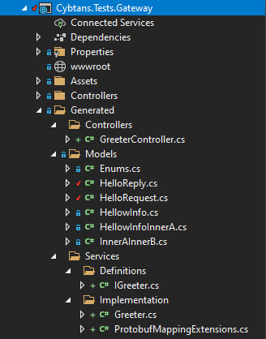

#  Cybtans CLI
[](https://dev.azure.com/cybtans/CybtansSDK/_build/latest?definitionId=4&branchName=main)

# Cybtans CLI
The Cybtans command-line interface (CLI) is a cross-platform [Protobuff]((https://developers.google.com/protocol-buffers)) compiler for generating [RESTfull](https://en.wikipedia.org/wiki/Representational_state_transfer) APIs and REST clients for .NET ,React and Angular. In addition you can use it for speeding up [Grpc](https://grpc.io) development by generating proto files from .NET assemblies and mapping code.

In addition you can use the tool as shown bellow for generating a microservice's projects structure.

```bash
cybtans-cli service -n MyMicroservice -o ./MyMicroservice -sln .\MySolution.sln
``` 
The projects structure follows this architecture convention:

- **MyMicroservice.Clients**:
This project contains typed REST client for .NET Standard. You can use this clases for consuming your endpoints in integration tests, mvc, blazor or xamaring apps for example. REST client classes are autogenerated.
- **MyMicroservice.Models**
This project contains your service models, aka the models exposed throught the Web API. Model classes are autogenerated
- **MyMicroservice.Data**
This project contains your database models or entities and custom repository interfaces
- **MyMicroservice.Data.EntityFramework**
This project contains your Entity Framework context , database mappings and repository implementations
- **MyMicroservice.RestApi**
This project contains the Rest API code. You need to take care of registering the additional dependencies in the Startup class, setup authentication, etc. 
Api Controllers are autogenerated.
- **MyMicroservice.Services**
This project is where your business logic goes. Service interfaces are autogenerated. You need to implement the interfaces.
- **Products.Services.Tests**
This project is where your unit or integration test goes. If you use [integration tests](https://docs.microsoft.com/en-us/aspnet/core/test/integration-tests?view=aspnetcore-5.0) you can use the MyMicroservice.Clients classes for calling your endpoints using an in-memory test server.
- **Proto**
This folder contains definitions in the protobuff language for messages and services. The cli generates models, clients, controllers, services from these proto definitions


Of cource this is a handy command and you not need to use this architectural convention. The cybtans cli tool use configurations files to override the default conventions so you can organize your project in any way you want and generate the code that best fits you needs or style.


## Protobuff for REST APIs

First download the cybtans cli for your platform. Extract it and additionally add the folder where you extract the executable to your PATH.
- [Windows](https://cybtans.blob.core.windows.net/cybtans-cli/cybtans-cli_x64.zip)
- [Mac](https://cybtans.blob.core.windows.net/cybtans-cli/cybtans-cli_mac.zip)
- [Portable](https://cybtans.blob.core.windows.net/cybtans-cli/cybtans-cli_portable.zip)


Next you need to add a file named `cybtans.json` to your solution. If you generate the projects with the `cybtans-cli` this file is already generated for you. If you want to use .NET 5 just change `netcoreapp3.1` for `net5.0`

```json
{
    "Service": "MyMicroservice",
    "Steps":[
        {
          "Type": "messages",
          "Output": ".",
          "ProtoFile": "./Proto/Data.proto",
          "AssemblyFile": "./MyMicroservice.RestApi/bin/Debug/netcoreapp3.1/MyMicroservice.Data.dll"
        },
        {
            "Type": "proto",
            "Output": ".",
            "ProtoFile": "./Proto/MyMicroservice.proto"
        }
    ]
}
```
This cybtans.json files defines the microservice name and several steps. 
The first step with `type = message` generates a proto file named `data.proto` from your `MyMicroservice.Data.dll` assembly. For example if you use a code first approach and define an entity like this:

```csharp
using System;
using System.Collections.Generic;
using System.ComponentModel;
using System.ComponentModel.DataAnnotations;
using Cybtans.Entities;

[Description("Customer Entity")]
[GenerateMessage("CustomerDto")]
public class Customer
{
    public Guid Id {get; set;}

    [Description("Customer's Name")]
    [Required]
    public string Name { get; set; }

    [Description("Customer's FirstLastName")]    
    public string FirstLastName { get; set; }

    [Description("Customer's SecondLastName")]    
    [Obsolete]
    public string SecondLastName { get; set; }

    [Description("Customer's Profile Id, can be null")]    
    public Guid? CustomerProfileId { get; set; }
    
    public virtual CustomerProfile CustomerProfile { get; set; }

    [MessageExcluded]
    public virtual ICollection<Order> Orders { get; set; } = new HashSet<Order>();
}
```
Next, run the tool specifying the root folder where it will look for the `cybtans.json` files. So if you run it from the solution's folder it should be: 
```
cybtans-cli .
```
The tool generates the following message in the `data.proto` file.
```proto
message CustomerDto {
    option description = "Customer Entity";

    string name = 1 [required = true, description = "Customer's Name"];
    string firstLastName = 2 [description = "Customer's FirstLastName"];
    string secondLastName = 3 [description = "Customer's SecondLastName", deprecated = true];
    guid customerProfileId = 4 [optional = true, description = "Customer's Profile Id, can be null"];
    CustomerProfileDto customerProfile = 5;
    guid id = 6;
    datetime createDate = 7 [optional = true];
    datetime updateDate = 8 [optional = true];
}
```

In addition you can generate a service definition by using the attribute `[GenerateMessage("CustomerDto", Service = ServiceType.Interface)]`.

```proto

message GetCustomerRequest {
	guid id = 1;
}

message UpdateCustomerRequest {
	guid id = 1;
	CustomerDto value = 2 [(ts).partial = true];
}

message DeleteCustomerRequest{
	guid id = 1;
}

message GetAllCustomerResponse {
	repeated CustomerDto items = 1;
	int64 page = 2;
	int64 totalPages = 3;
	int64 totalCount = 4;
}

message CreateCustomerRequest {
	CustomerDto value = 1 [(ts).partial = true];
}

service CustomerService {
	option (prefix) ="api/Customer";

	rpc GetAll(GetAllRequest) returns (GetAllCustomerResponse){		
		option method = "GET";		
	};

	rpc Get(GetCustomerRequest) returns (CustomerDto){	
		option template = "{id}"; 
		option method = "GET";
	};

	rpc Create(CreateCustomerRequest) returns (CustomerDto){			
		option method = "POST";		
	};

	rpc Update(UpdateCustomerRequest) returns (CustomerDto){			
		option template = "{id}"; 
		option method = "PUT";		
	};

	rpc Delete(DeleteCustomerRequest) returns (void){
		option template = "{id}"; 
		option method = "DELETE";		
	};
}
```
You can also control what properties are included in the message, by using the `[MessageExcluded]` attribute. These attributes are located in the `Cybtans.Entities.Proto` package. Install this package with 
```
dotnet add package Cybtans.Entities.Proto --version 1.2.1
```

Finally in the main proto `MyMicroservice.proto` that was specified in the `cybtans.json` import the `Data.proto` like shown below:

```proto
syntax = "proto3";

import "Data.proto";

package MyMicroservice;

// Add addtional services and messages here
.......
.......

```


All the supported options by the cybtans-cli are located in the [cybtans.proto](https://github.com/ansel86castro/cybtans-cli/blob/main/src/Cybtans.Proto/cybtans.proto) file as a reference. But you don't need to include this file when using the cybtans-cli.

You can generate typescript clients for React ,Angular and also REST API Gateway by using this configuration as an example:

```json
{
    "Service": "MyMicroservice",
    "Steps":[
        {
          "Type": "messages",
          "Output": ".",
          "ProtoFile": "./Proto/Data.proto",
          "AssemblyFile": "./MyMicroservice.RestApi/bin/Debug/netcoreapp3.1/MyMicroservice.Data.dll"
        },
        {
            "Type": "proto",
            "Output": ".",
            "ProtoFile": "./Proto/MyMicroservice.proto",
            "Gateway": "./App.Gateway/Controllers/MyMicroservice",
            "Clients": [
            {
                "Output": "./react-app/src/services/my-microservice",
                "Framework": "react"
            },
            {
                "Output": "./angular-app/src/app/services/my-microservice",
                "Framework": "angular"
            }
            ]
        }
    ]
}
```

#### Overriding Conventions
You can control how do you want to generate code for your REST API. For example specifying custom output folders and namespaces:
```json
{
  "Service": "MyWebAPI",
  "Steps": [
    {
      "Type": "proto",
      "ProtoFile": "./Proto/api.proto",
      "Models": {
        "Output": "./MyWebAPI/Generated/Models",
        "Namespace": "Api.Models"
      },
      "Services": {
        "Output": "./MyWebAPI/Generated/Services",
        "Namespace": "Api.Services.Definitions"
      },
      "Controllers": {
        "Output": "./MyWebAPI/Generated/Controllers",
        "Namespace": "Api.Controllers"
      },
      "CSharpClients":{
        "Output": "../MyWebAPIGateway/Generated/Clients",
        "Namespace": "Api.Clients"
      },
      "GatewayOptions":{
        "Output": "../MyWebAPIGateway/Generated/Controllers",
        "Namespace": "Api.Controllers"
      },
      "Clients": [
        {
          "Output": "../WebApp/src/app/services",
          "Framework": "angular"
        }
      ]
    }
  ]
}
```
## GRPC Support
### Generating proto files for the grpc protobuff compiler
You can use the cybtans-cli with the google protobuf compiler in order to generate messages from your .NET assemblies and mapping code. For example you can add the following settings to the `cybtans.json`

```json
{
 
  "Steps": [
    {
      "Type": "messages",
      "Output": ".",
      "ProtoFile": "./protos/data.proto",
      "AssemblyFile": "../MyGrpcSerivice.Data/bin/Debug/net5.0/MyGrpcSerivice.Data.dll",      
      "Grpc": {
        "Enable": true,
        "MappingOutput": "../MyGrpcSerivice.Service/Mappings",
        "MappingNamespace": "MyGrpcSerivice.Service",
        "GrpcNamespace": "MyGrpcSerivice.Service"
      }
    }
  ]
}
```
Using this configuration file the cybtans-cli will generate a protoc (google protobuff compiler) compatible file with something like this:

```proto
syntax = "proto3";

option csharp_namespace = "MyGrpcSerivice.Service";

import "google/protobuf/timestamp.proto";
import "google/protobuf/duration.proto";

message CustomerDto {
    option description = "Customer Entity";

    string name = 1;
    string firstLastName = 2;
    string secondLastName = 3;
    string customerProfileId = 4;
    CustomerProfileDto customerProfile = 5;
    string id = 6;
    google.protobuf.Timestamp createDate = 7 [optional = true];
    google.protobuf.Timestamp updateDate = 8 [optional = true];
}
```

In addition the cybtans-cli allows you to generate REST API Controller that calls your Grpc services. For example you can define the following `cybtans.json` file.

```json
{
  "Service": "Cybtans.Tests.Grpc",
  "Steps": [
    {
      "Type": "proto",
      "ProtoFile": "../Proto/greet.proto",
      "Models": {
        "Output": "../Cybtans.Tests.Gateway/Generated/Models",
        "Namespace": "Cybtans.Tests.Gateway.Models",
        "UseCytansSerialization": false
      },
      "Services": {
        "Output": "../Cybtans.Tests.Gateway/Generated/Repository/Definitions",
        "Namespace": "Cybtans.Test.Gateway.Repository.Definition",
        "Grpc": {
          "Output": "../Cybtans.Tests.Gateway/Generated/Repository/Implementation",
          "Namespace": "Cybtans.Test.Gateway.Repository.Implementation",
          "AutoRegister" :  true
        }
      },
      "Controllers": {
        "Output": "../Cybtans.Tests.Gateway/Controllers/Grpc"       
      },
      "Clients": [
        {
          "Output": "../react-app/src/services/grpc",
          "Framework": "react"
        },
        {
          "Output": "../angular-app/src/app/services/grpc",
          "Framework": "angular"
        }
      ]
    }
  ]
}
```

In your Grpc project then you can create a proto file like this one:
```proto
syntax = "proto3";

option csharp_namespace = "Cybtans.Tests.Grpc";

import "google/protobuf/timestamp.proto";
import "google/protobuf/duration.proto";
import "google/protobuf/wrappers.proto";
import "google/protobuf/empty.proto";

//important to add this file for grpc
import "cybtans.proto";

package greet;

// The greeting service definition.
service Greeter {
  option (prefix) = "greeter";

  //important add this seeting to generate REST Api Controllers
  option (grpc_proxy) = true;

  // Sends a greeting
  rpc SayHello (HelloRequest) returns (HelloReply){
    option (template) = "hello"; 
    option (method) = "GET";		
  }
}

message HelloRequest {
  string name = 1;  
}

// The response message containing the greetings.
message HelloReply {
  string message = 1;  
  HellowInfo info = 2; 
}

message HellowInfo {
	int32 id = 1;
	Type type = 3;	
	InnerA innerA = 4;  
	enum Type{
		A = 0;
		B = 1;
	}
	message InnerA {
		InnerB b = 1;
		message InnerB {			
			Type type = 1;
			enum Type{
				A = 0;
				B = 1;
			}
		}
	}
}
```
As a result you will find the following files generated for you.



In the API Gateway project remember to register the Grpc client ,for example:
```csharp
 services.AddGrpcClient<Greeter.GreeterClient>(o =>
  {                
      o.Address = new Uri(Configuration["GreteerServiceUrl"]);
  });
```

In addition the autogenerated `ProtobuffMppingExtensions.cs` file contains extension methods that you can use to convert from POCO objects to Protobuff messages and in the other way around.

More examples can be found in the [Cybtans SDK Repository](https://github.com/ansel86castro/cybtans-sdk/tree/master/CybtansSDK/Tests).

### Sponsorship and Support
If you like this project you can send you support at https://paypal.me/anselcastrocabrera. 

**Powered By Cybtans**
www.cybtans.com


